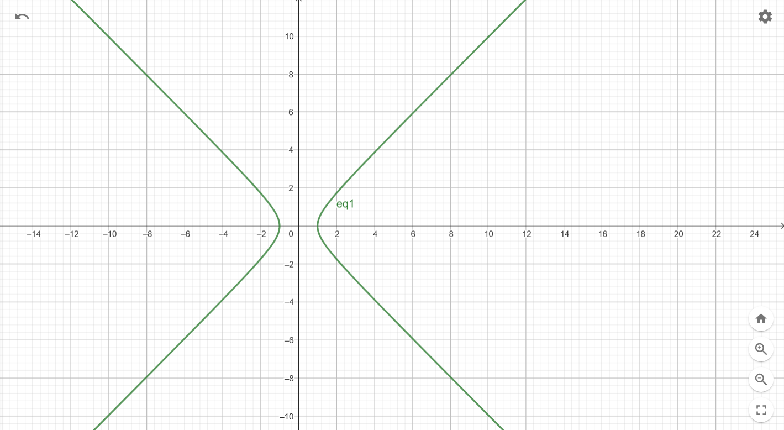
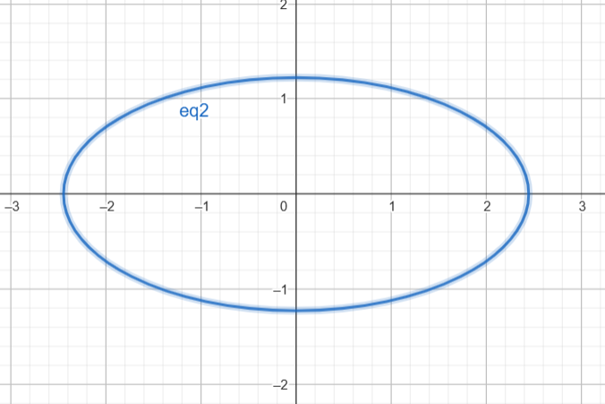

Hyperbola: $x^2 - y^2 = 1$

Ellipse: $x^2 + 4y^2 = 6$

1-step  
Substitute $y^2$ of the hyperbola into the ellipse equation:  

$$x^2 + 4(x^2 - 1) = 6$$  
$$5x^2 = 10$$  
$$x^2 = 2$$  
$$x = \pm \sqrt{2}$$  

2-step  
Substitute $x^2 = 2$ into:  

$$y^2 = x^2 - 1$$  
$$y^2 = 2 - 1$$  
$$y^2 = 1$$  
$$y = \pm 1$$  

**Intersection points are:**
$$(\sqrt{2}, 1), (\sqrt{2}, -1), (-\sqrt{2}, 1), (-\sqrt{2}, -1)$$
