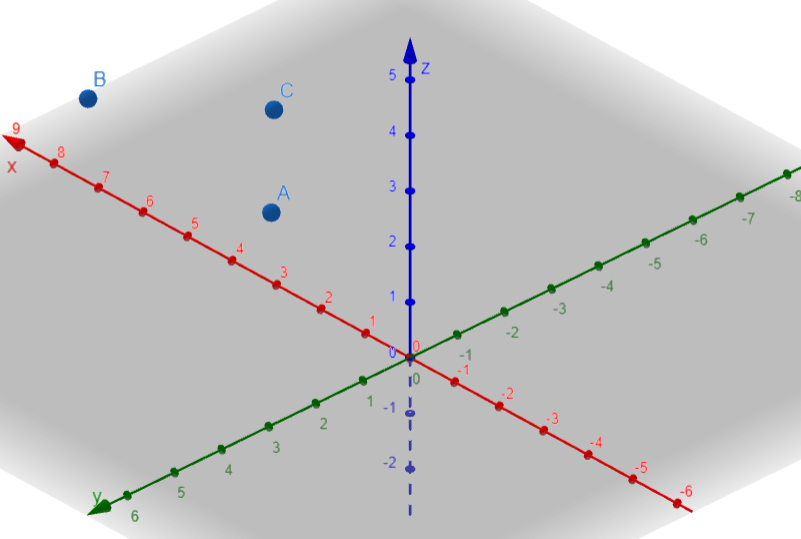
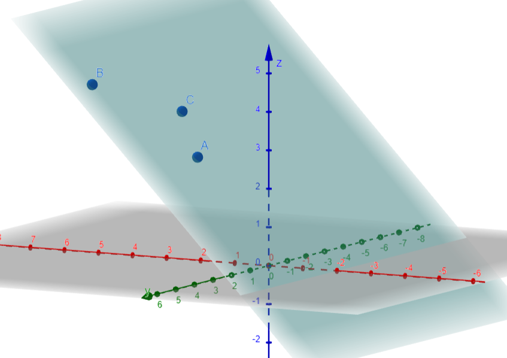
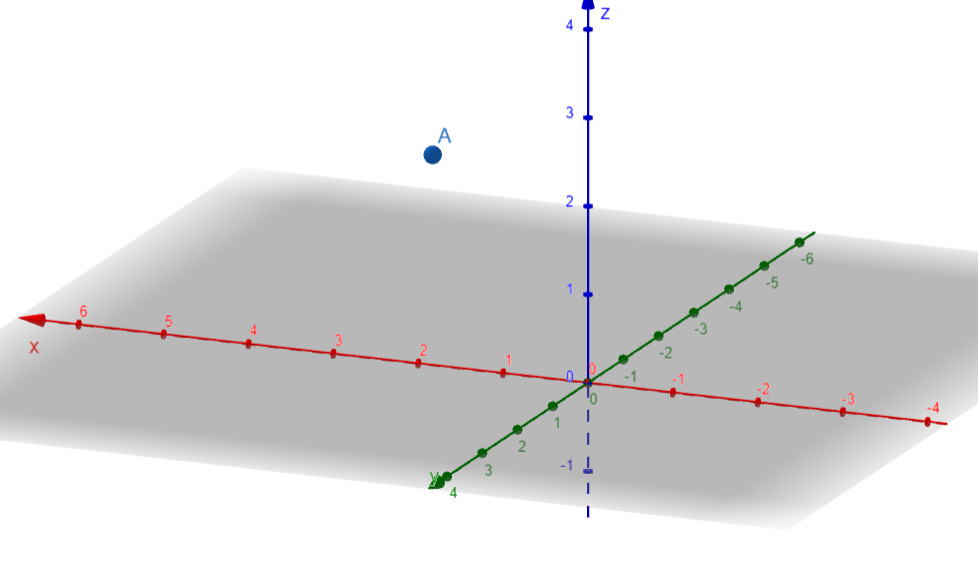
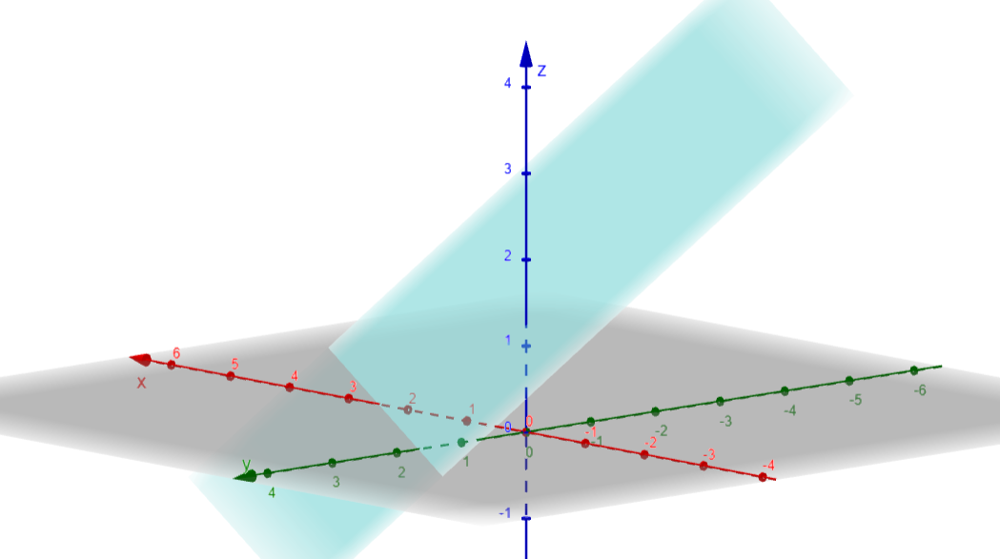
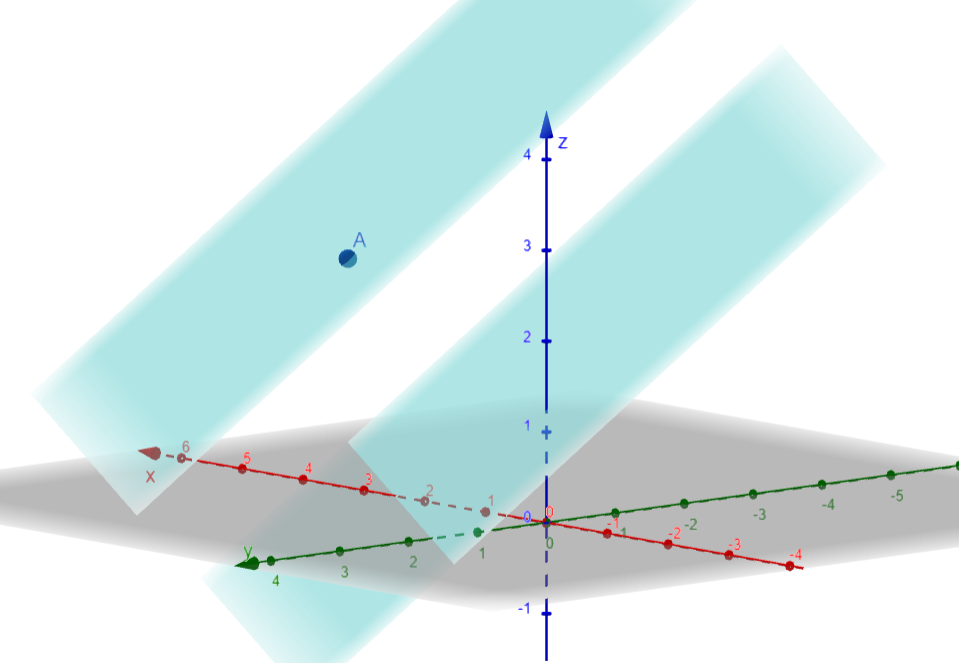

**Planes in Space**

**Task 1:**
 
- The plane passes through points \(A(1, 2, 3)\), \(B(3, 4, 5)\), and \(C(2, 1, 4)\). Find the equation of the plane.

Points:
- $A = (1, 2, 3)$
- $B = (3, 4, 5)$
- $C = (2, 1, 4)$

**Step 1: Calculate direction vectors**

It can be $\vec{AB}$ and $\vec{AC}$:
- $\vec{AB} = (B_x - A_x, B_y - A_y, B_z - A_z) = (3-1, 4-2, 5-3) = (2, 2, 2)$
- $\vec{AC} = (C_x - A_x, C_y - A_y, C_z - A_z) = (2-1, 1-2, 4-3) = (1, -1, 1)$

**Step 2: Finding normal vectors**

Normal vector can be found by taking the cross product of $\vec{AB}$ and $\vec{AC}$

$$
\vec{AB} \times \vec{AC} = 
\begin{vmatrix}
\mathbf{i} & \mathbf{j} & \mathbf{k} \\
2 & 2 & 2 \\
1 & -1 & 1 \\
\end{vmatrix} = \mathbf{i}(2 \cdot 1 - 2 \cdot (-1)) - \mathbf{j}(2 \cdot 1 - 2 \cdot 2) + \mathbf{k}(2 \cdot (-1) - 2 \cdot 1)
$$

$$
= \mathbf{i}(2 + 2) - \mathbf{j}(2 - 4) + \mathbf{k}(-2 - 2)
= 4\mathbf{i} - (-2)\mathbf{j} - 4\mathbf{k}
= 4\mathbf{i} + 2\mathbf{j} - 4\mathbf{k}
$$

The normal vector is: $(4, 0, -4)$.

We will use this to form the plane equation and substitute the point $A(1, 2, 3)$ to find $D$:

$$4x + 0y - 4z = D \rightarrow 4x - 4z = D$$

Substituting point $A(1, 2, 3)$:
$$4(1) - 4(3) = D$$

$$4 - 12 = D$$

$$D = -8$$

Thus, the equation of the plane is:
$$4x - 4z = -8$$

**Task 2**

- The plane passes through point \(A(1, 2, 3)\) and is parallel to the plane given by the equation \(2x + 3y + 4z = 5\). Find the equation of the plane.

Point A:

Parallel Plane:

**Step 1:**
Two planes are parallel if their normal vectors are parallel or proportional.

Given plane $2x + 3y + 4z = 5$ has the normal vector  $(2, 3, 4)$.

**Step 2:**
The general equation of a plane using a point $P(x_1, y_1, z_1)$ and a normal vector $\vec{N} = (a, b, c)$ is:

$$
a(x - x_1) + b(y - y_1) + c(z - z_1) = 0
$$

Simplify:

$$
ax + by + cz = ax_1 + by_1 + cz_1
$$

**Step 3:**
Substitute values $\vec{N} = (2, 3, 4)$ and $A = (1, 2, 3)$:

$$
2(x - 1) + 3(y - 2) + 4(z - 3) = 0
$$

Expanding and simplifying:

$$
2(x - 1) + 3(y - 2) + 4(z - 3) = 0 \implies 2x - 2 + 3y - 6 + 4z - 12 = 0 \implies 2x + 3y + 4z - 20 = 0
$$

The final equation is:

$$
2x + 3y + 4z = 20
$$

