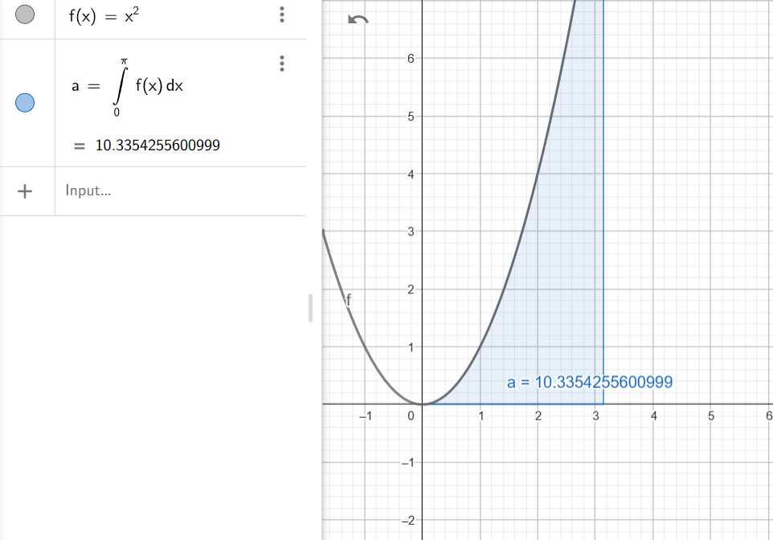

### Solutions:

1. **$\int 1 \, dx$**  
   $$\int 1 \, dx = x + C$$

2. **$\int (x^2 + 2) \, dx$**  
   $$\int (x^2 + 2) \, dx = \frac{x^3}{3} + 2x + C$$

3. **$\int 2\sin(x) \, dx$**  
   $$\int 2\sin(x) \, dx = -2\cos(x) + C$$

4. **$\int \frac{3}{x} \, dx$**  
   $$\int \frac{3}{x} \, dx = 3\ln|x| + C$$

5. **$\int \frac{1}{x^2} \, dx$**  
   $$\int \frac{1}{x^2} \, dx = -\frac{1}{x} + C$$

6. **$\int \left( \frac{1}{3}x^4 - 5 \right) \, dx$**  
   $$\int \left( \frac{1}{3}x^4 - 5 \right) \, dx = \frac{1}{15}x^5 - 5x + C$$

7. **$\int (\sin^2(x) + \cos^2(x)) \, dx$**  
   Using the identity $\sin^2(x) + \cos^2(x) = 1$,  
   $$\int (\sin^2(x) + \cos^2(x)) \, dx = x + C$$

8. **$\int (5\sin(x) + 3e^x) \, dx$**  
   $$\int (5\sin(x) + 3e^x) \, dx = -5\cos(x) + 3e^x + C$$

9. **$\int \sqrt[3]{x} \, dx$**  
   Rewrite $\sqrt[3]{x} = x^{1/3}$:  
   $$\int \sqrt[3]{x} \, dx = \frac{3}{4}x^{4/3} + C$$

10. **$\int \sqrt{10x} \, dx$**  
    Rewrite $\sqrt{10x} = \sqrt{10} \cdot x^{1/2}$:  
    $$\int \sqrt{10x} \, dx = \frac{2\sqrt{10}}{3}x^{3/2} + C$$

11. **$\int \cos\left(\frac{5}{2}x + 3\right) \, dx$**  
    Use substitution: Let $u = \frac{5}{2}x + 3$, so $du = \frac{5}{2}dx$:  
    $$\int \cos\left(\frac{5}{2}x + 3\right) \, dx = \frac{2}{5} \sin\left(\frac{5}{2}x + 3\right) + C$$

12. **$\int \frac{\cos(\ln(x))}{x} \, dx$**  
    Use substitution: Let $u = \ln(x)$, so $du = \frac{1}{x}dx$:  
    $$\int \frac{\cos(\ln(x))}{x} \, dx = \sin(\ln(x)) + C$$

13. **$\int x \ln(x) \, dx$**  
    Use integration by parts: Let $u = \ln(x)$ and $dv = x \, dx$:  
    $$\int x \ln(x) \, dx = \frac{x^2}{2} \ln(x) - \frac{x^2}{4} + C$$

14. **$\int x e^x \, dx$**  
    Use integration by parts: Let $u = x$ and $dv = e^x \, dx$:  
    $$\int x e^x \, dx = (x - 1)e^x + C$$

### Solutions:

We are calculating the integrals of two functions over the interval \([0, \pi]\):

---

1. **Integral of \( f(x) = 2x + 1 \):**
   $$\int_{0}^{\pi} (2x + 1) \, dx$$

   #### Step 1: Integrate \( f(x) \)
   Using the linearity of integration:
   $$\int (2x + 1) \, dx = \int 2x \, dx + \int 1 \, dx = x^2 + x + C$$

   #### Step 2: Evaluate over \([0, \pi]\)
   Substituting the limits of integration:
   $$\int_{0}^{\pi} (2x + 1) \, dx = \left[ x^2 + x \right]_0^\pi$$

   Calculating:
   $$\int_{0}^{\pi} (2x + 1) \, dx = \left( (\pi)^2 + \pi \right) - \left( 0^2 + 0 \right)$$

   Final result:
   $$\int_{0}^{\pi} (2x + 1) \, dx = \pi^2 + \pi$$

  

---

2. **Integral of \( g(x) = x^2 \):**
   $$\int_{0}^{\pi} x^2 \, dx$$

   #### Step 1: Integrate \( g(x) \)
   Using the power rule for integration:
   $$\int x^2 \, dx = \frac{x^3}{3} + C$$

   #### Step 2: Evaluate over \([0, \pi]\)
   Substituting the limits of integration:
   $$\int_{0}^{\pi} x^2 \, dx = \left[ \frac{x^3}{3} \right]_0^\pi$$

   Calculating:
   $$\int_{0}^{\pi} x^2 \, dx = \frac{(\pi)^3}{3} - \frac{(0)^3}{3}$$

   Final result:
   $$\int_{0}^{\pi} x^2 \, dx = \frac{\pi^3}{3}$$

