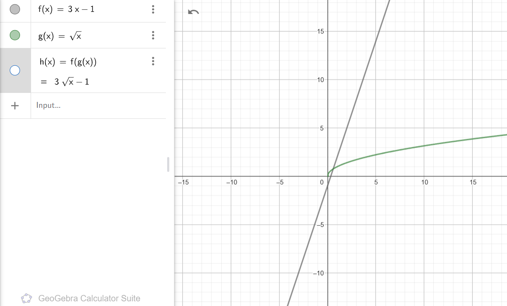
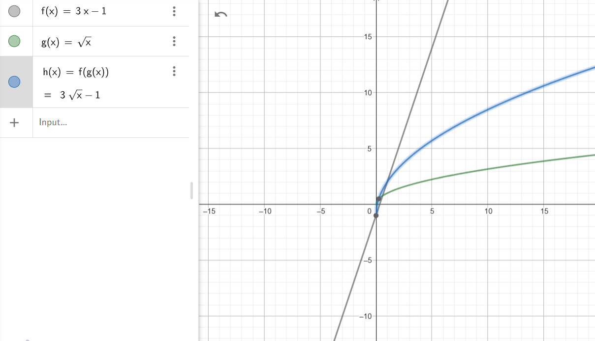
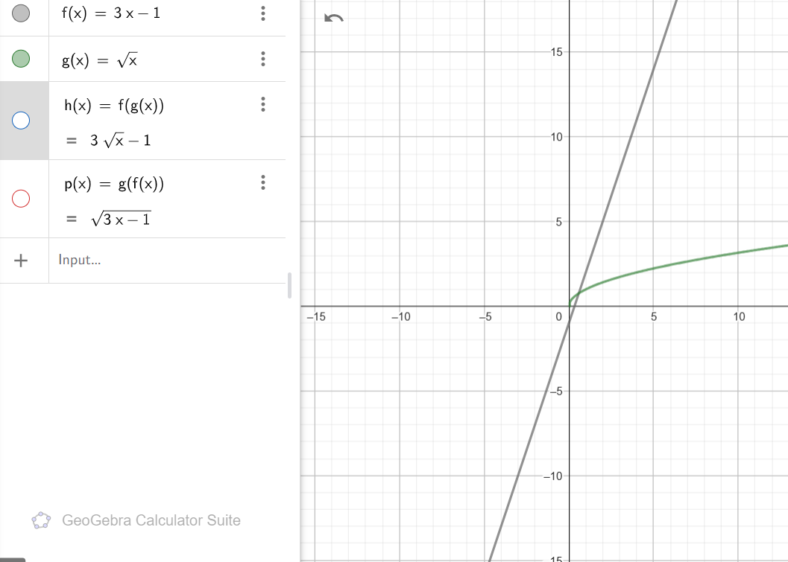
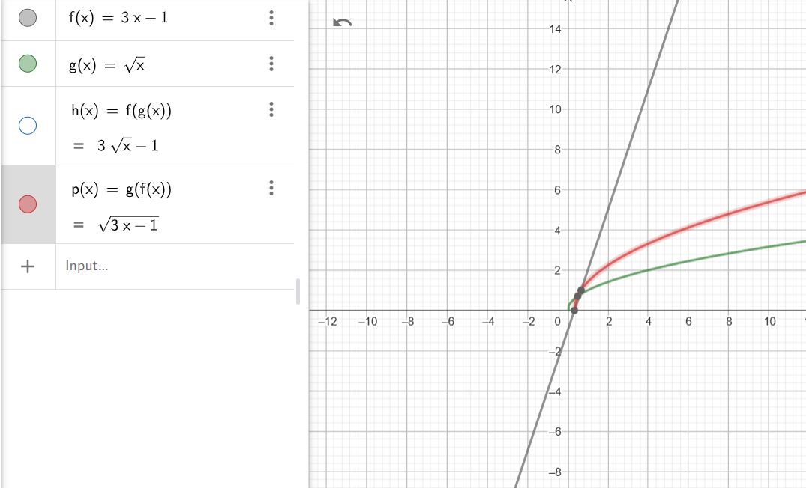
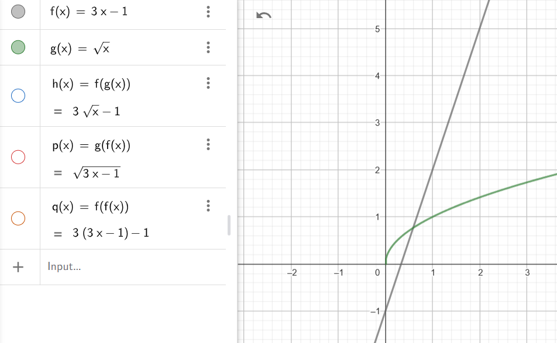
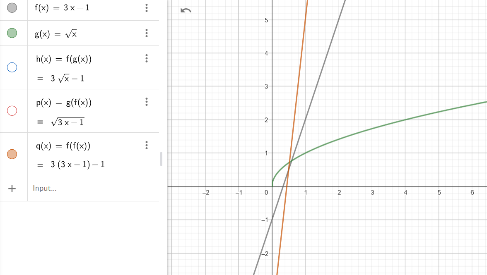
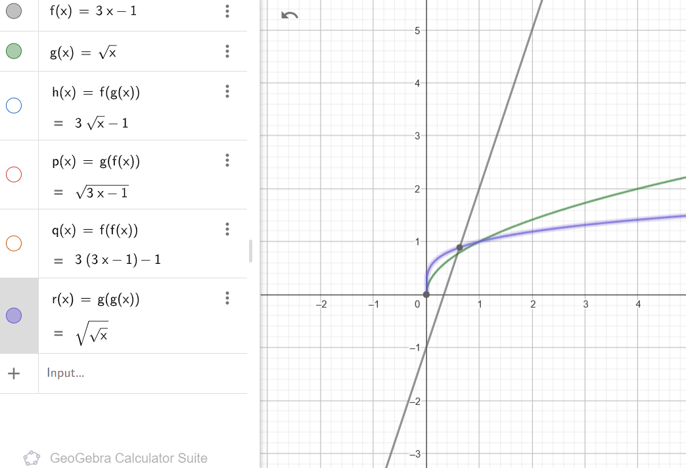
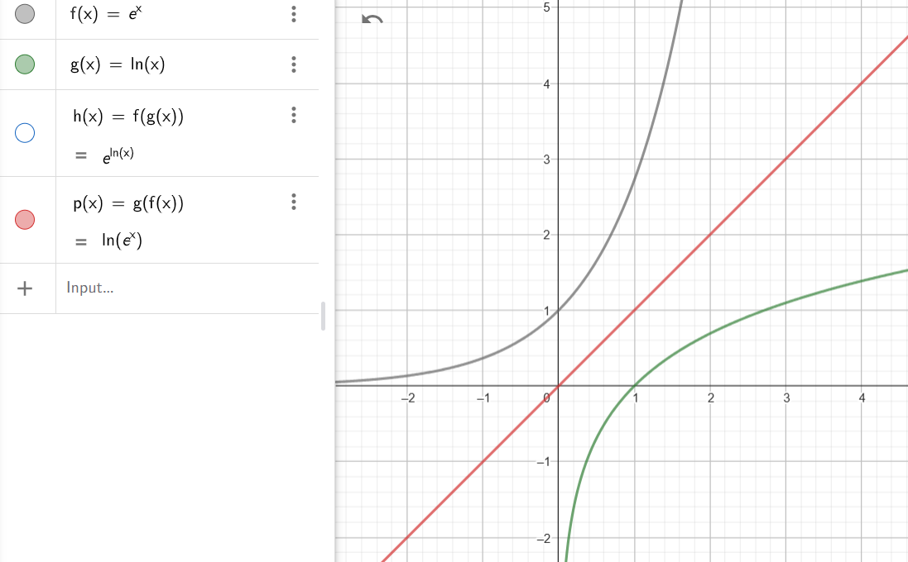
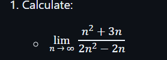
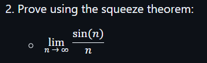

### Problem

Let $f(x) = 3x - 1$ and $g(x) = \sqrt{x}$. Find:
- $f(g(x))$
- $g(f(x))$
- $f(f(x))$
- $g(g(x))$

and visualize functions in a single GeoGebra notebook.

                                          TASK-1

### Solution

#### Given:
1. $f(x) = 3x - 1$
2. $g(x) = \sqrt{x}$

We need to compute $f(g(x))$, which means substituting $g(x)$ into $f(x)$.

---

#### Steps:
1. Substitute $g(x) = \sqrt{x}$ into $f(x) = 3x - 1$:

   $$f(g(x)) = f(\sqrt{x})$$

2. Apply the definition of $f(x) = 3x - 1$, replacing $x$ in $f(x)$ with $\sqrt{x}$:

   $$f(\sqrt{x}) = 3(\sqrt{x}) - 1$$

3. Simplify:

   $$f(g(x)) = 3\sqrt{x} - 1$$

---

### Final Answer:
$$ f(g(x)) = 3\sqrt{x} - 1 $$

--------------------------------------------------------------------------------------------------------
                                                      TASK-2

### Solution

#### Given:
1. $f(x) = 3x - 1$
2. $g(x) = \sqrt{x}$

We need to compute $g(f(x))$, which means substituting $f(x)$ into $g(x)$.

---

#### Steps:
1. Substitute $f(x) = 3x - 1$ into $g(x) = \sqrt{x}$:
   $$ g(f(x)) = g(3x - 1) $$

2. Apply the definition of $g(x) = \sqrt{x}$, replacing $x$ in $g(x)$ with $3x - 1$:
   $$ g(3x - 1) = \sqrt{3x - 1} $$

3. Simplify:
   $$ g(f(x)) = \sqrt{3x - 1} $$

---

### Final Answer:
$$ g(f(x)) = \sqrt{3x - 1} $$

-------------------------------------------------------------------------------------------------------------------------------
                                                    TASK-3
 ### Solution

#### Given:
1. $f(x) = 3x - 1$
2. $g(x) = \sqrt{x}$

We need to compute $f(f(x))$, which means applying $f(x)$ to the result of $f(x)$.

---

#### Steps:
1. Start with $f(x) = 3x - 1$. This is the first application of $f(x)$.

2. Apply $f$ again, replacing $x$ in $f(x)$ with $f(x)$:
   $$f(f(x)) = f(3x - 1)$$

3. Use the definition of $f(x) = 3x - 1$, replacing $x$ in $f(x)$ with $3x - 1$:
   $$f(3x - 1) = 3(3x - 1) - 1$$

4. Simplify:
 $$f(3x - 1) = 9x - 3 - 1$$
 $$f(3x - 1) = 9x - 4$$

---

### Final Answer:
$$f(f(x)) = 9x - 4$$
                                            
         
--------------------------------------------------------------------------------------------------------
                                         TASK-4
### Solution

#### Given:
1. $f(x) = 3x - 1$
2. $g(x) = \sqrt{x}$

We need to compute $g(g(x))$, which means applying $g(x)$ to the result of $g(x)$.

---

#### Steps:
1. Start with $g(x) = \sqrt{x}$. This is the first application of $g(x)$.

2. Apply $g$ again, replacing $x$ in $g(x)$ with $g(x)$:
   $$g(g(x)) = g(\sqrt{x})$$

3. Use the definition of $g(x) = \sqrt{x}$, replacing $x$ in $g(x)$ with $\sqrt{x}$:
   $$g(\sqrt{x}) = \sqrt{\sqrt{x}}$$

4. Simplify:
   $$g(g(x)) = x^{1/4}$$

---

### Final Answer:
$$g(g(x)) = x^{1/4}$$

-------------------------------------------------------------------------------------------------

### Problem

Let $f(x) = e^x$ and $g(x) = \ln(x)$. Check:
- $f(g(x))$
- $g(f(x))$

---

### Solution

1. **Compute $f(g(x))$:**
   Substitute $g(x) = \ln(x)$ into $f(x) = e^x$:
   $$f(g(x)) = f(\ln(x)) = e^{\ln(x)}$$

   Using the property of logarithms and exponents ($e^{\ln(x)} = x$):
   $$f(g(x)) = x$$

2. **Compute $g(f(x))$:**
   Substitute $f(x) = e^x$ into $g(x) = \ln(x)$:
   $$g(f(x)) = g(e^x) = \ln(e^x)$$

   Using the property of logarithms ($\ln(e^x) = x$):
   $$g(f(x)) = x$$

---

### Observation
For both $f(g(x))$ and $g(f(x))$, the result is:
$$x$$

This shows that $f(x)$ and $g(x)$ are **inverse functions** of each other.

-------------------------------------------------------------------------------------------------------------

### Solution

To find the inverse of the given function $f=\{(1,7),(2,9),(3,11)\}$, we swap the input (domain) and output (range) for each pair.

---

### Original Function:
$$f=\{(1,7),(2,9),(3,11)\}$$

### Inverse Function:
For the inverse function $f^{-1}$, swap each pair:

$$f^{-1}=\{(7,1),(9,2),(11,3)\}$$

---

### Final Answer:
$$f^{-1}=\{(7,1),(9,2),(11,3)\}$$

---------------------------------------------------------------------------------------------------------------------

### Solution

To find the inverse of the given function $f=\{(1,7),(2,7),(3,11)\}$, we swap the input (domain) and output (range) for each pair.

---

### Original Function:
$$f=\{(1,7),(2,7),(3,11)\}$$

### Inverse Function:
For the inverse function $f^{-1}$, swap each pair. Note that since $7$ corresponds to two different inputs $(1,7)$ and $(2,7)$, the function is **not one-to-one** and does not have a proper inverse.

---

### Final Answer:
The function $f=\{(1,7),(2,7),(3,11)\}$ does not have an inverse because it is not one-to-one.

-------------------------------------------------------------------------------------------------

### Solution

We need to calculate:

$$\lim_{n\to\infty}\frac{n^2+3n}{2n^2-2n}$$

---

### Step 1: Simplify the expression
The highest power of $n$ in both the numerator and denominator is $n^2$. To simplify, divide every term in the numerator and denominator by $n^2$:

$$\frac{n^2+3n}{2n^2-2n}=\frac{\frac{n^2}{n^2}+\frac{3n}{n^2}}{\frac{2n^2}{n^2}-\frac{2n}{n^2}}=\frac{1+\frac{3}{n}}{2-\frac{2}{n}}$$

---

### Step 2: Take the limit as $n\to\infty$
As $n$ approaches infinity, terms like $\frac{3}{n}$ and $\frac{2}{n}$ approach $0$. This leaves us with:

$$\frac{1+0}{2-0}=\frac{1}{2}$$

---

### Final Answer:
$$\frac{1}{2}$$

--------------------------------------------------------------------------------

### Solution

We need to calculate:

$$\lim_{n\to\infty}\frac{(2n+3)^3}{n^3-1}$$

---------------------------------------------------------------------------------------

### Step 1: Expand the numerator
Expand $(2n+3)^3$ using the binomial theorem:

$$(2n+3)^3=(2n)^3+3(2n)^2(3)+3(2n)(3^2)+3^3=8n^3+12n^2+18n+27$$

So, the fraction becomes:

$$\frac{(2n+3)^3}{n^3-1}=\frac{8n^3+12n^2+18n+27}{n^3-1}$$

---

### Step 2: Divide all terms by $n^3$
To simplify, divide both the numerator and the denominator by $n^3$:

$$\frac{8n^3+12n^2+18n+27}{n^3-1}=\frac{\frac{8n^3}{n^3}+\frac{12n^2}{n^3}+\frac{18n}{n^3}+\frac{27}{n^3}}{\frac{n^3}{n^3}-\frac{1}{n^3}}=\frac{8+\frac{12}{n}+\frac{18}{n^2}+\frac{27}{n^3}}{1-\frac{1}{n^3}}$$

---

### Step 3: Take the limit as $n\to\infty$
As $n$ approaches infinity, terms like $\frac{12}{n}$, $\frac{18}{n^2}$, $\frac{27}{n^3}$, and $\frac{1}{n^3}$ approach $0$. This simplifies to:

$$\frac{8+0+0+0}{1-0}=8$$

---

### Final Answer:
$$\lim_{n\to\infty}\frac{(2n+3)^3}{n^3-1}=8$$

----------------------------

### Solution

We need to prove:

$$\lim_{n\to\infty}\frac{\sin(n)}{n}=0$$

using the Squeeze Theorem.

-----------------------------

### Step 1: Use the bounded property of $\sin(n)$
The sine function is bounded, meaning:

$$-1\leq\sin(n)\leq1$$

---

### Step 2: Divide through by $n$ (for $n>0$)
Dividing the inequality by $n$, we get:

$$\frac{-1}{n}\leq\frac{\sin(n)}{n}\leq\frac{1}{n}$$

---

### Step 3: Apply the Squeeze Theorem
As $n\to\infty$, both $\frac{-1}{n}$ and $\frac{1}{n}$ approach $0$:

$$\lim_{n\to\infty}\frac{-1}{n}=0\quad\text{and}\quad\lim_{n\to\infty}\frac{1}{n}=0$$

By the Squeeze Theorem:

$$\lim_{n\to\infty}\frac{\sin(n)}{n}=0$$

---

### Final Answer:
$$\lim_{n\to\infty}\frac{\sin(n)}{n}=0$$

--------------------------------------------------------------------------

### Solution

We need to find the limit of the sequence:

$$a_n=\left(1+\frac{1}{n}\right)^n$$

---

### Step 1: Recognize the definition of $e$
The sequence resembles the mathematical definition of the constant $e$:

$$e=\lim_{n\to\infty}\left(1+\frac{1}{n}\right)^n$$

---

### Step 2: Apply the limit
As $n\to\infty$, the given sequence $a_n=\left(1+\frac{1}{n}\right)^n$ approaches the value of $e$.

---

### Final Answer:
$$\lim_{n\to\infty}a_n=e\approx2.718$$

