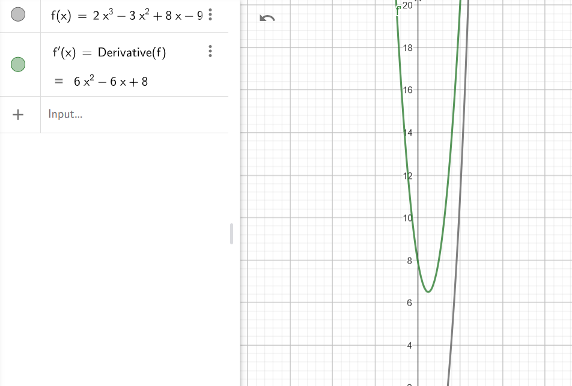

### Problem

Let $f(x) = 3x - 1$ and $g(x) = \sqrt{x}$. Find:
- $f(g(x))$
- $g(f(x))$
- $f(f(x))$
- $g(g(x))$

and visualize functions in a single GeoGebra notebook.

                                          TASK-1

### Solution

#### Given:
1. $f(x) = 3x - 1$
2. $g(x) = \sqrt{x}$

We need to compute $f(g(x))$, which means substituting $g(x)$ into $f(x)$.

---

#### Steps:
1. Substitute $g(x) = \sqrt{x}$ into $f(x) = 3x - 1$:

   $$f(g(x)) = f(\sqrt{x})$$

2. Apply the definition of $f(x) = 3x - 1$, replacing $x$ in $f(x)$ with $\sqrt{x}$:

   $$f(\sqrt{x}) = 3(\sqrt{x}) - 1$$

3. Simplify:

   $$f(g(x)) = 3\sqrt{x} - 1$$

---

### Final Answer:
$$ f(g(x)) = 3\sqrt{x} - 1 $$

--------------------------------------------------------------------------------------------------------
                                                      TASK-2

### Solution

#### Given:
1. $f(x) = 3x - 1$
2. $g(x) = \sqrt{x}$

We need to compute $g(f(x))$, which means substituting $f(x)$ into $g(x)$.

---

#### Steps:
1. Substitute $f(x) = 3x - 1$ into $g(x) = \sqrt{x}$:
   $$ g(f(x)) = g(3x - 1) $$

2. Apply the definition of $g(x) = \sqrt{x}$, replacing $x$ in $g(x)$ with $3x - 1$:
   $$ g(3x - 1) = \sqrt{3x - 1} $$

3. Simplify:
   $$ g(f(x)) = \sqrt{3x - 1} $$

---

### Final Answer:
$$ g(f(x)) = \sqrt{3x - 1} $$

-------------------------------------------------------------------------------------------------------------------------------
                                                    TASK-3
 ### Solution

#### Given:
1. $f(x) = 3x - 1$
2. $g(x) = \sqrt{x}$

We need to compute $f(f(x))$, which means applying $f(x)$ to the result of $f(x)$.

---

#### Steps:
1. Start with $f(x) = 3x - 1$. This is the first application of $f(x)$.

2. Apply $f$ again, replacing $x$ in $f(x)$ with $f(x)$:
   $$f(f(x)) = f(3x - 1)$$

3. Use the definition of $f(x) = 3x - 1$, replacing $x$ in $f(x)$ with $3x - 1$:
   $$f(3x - 1) = 3(3x - 1) - 1$$

4. Simplify:
 $$f(3x - 1) = 9x - 3 - 1$$
 $$f(3x - 1) = 9x - 4$$

---

### Final Answer:
$$f(f(x)) = 9x - 4$$
                                            
         
--------------------------------------------------------------------------------------------------------
                                         TASK-4
### Solution

#### Given:
1. $f(x) = 3x - 1$
2. $g(x) = \sqrt{x}$

We need to compute $g(g(x))$, which means applying $g(x)$ to the result of $g(x)$.

---

#### Steps:
1. Start with $g(x) = \sqrt{x}$. This is the first application of $g(x)$.

2. Apply $g$ again, replacing $x$ in $g(x)$ with $g(x)$:
   $$g(g(x)) = g(\sqrt{x})$$

3. Use the definition of $g(x) = \sqrt{x}$, replacing $x$ in $g(x)$ with $\sqrt{x}$:
   $$g(\sqrt{x}) = \sqrt{\sqrt{x}}$$

4. Simplify:
   $$g(g(x)) = x^{1/4}$$

---

### Final Answer:
$$g(g(x)) = x^{1/4}$$

-------------------------------------------------------------------------------------------------

### Problem

Let $f(x) = e^x$ and $g(x) = \ln(x)$. Check:
- $f(g(x))$
- $g(f(x))$

---

### Solution

1. **Compute $f(g(x))$:**
   Substitute $g(x) = \ln(x)$ into $f(x) = e^x$:
   $$f(g(x)) = f(\ln(x)) = e^{\ln(x)}$$

   Using the property of logarithms and exponents ($e^{\ln(x)} = x$):
   $$f(g(x)) = x$$

2. **Compute $g(f(x))$:**
   Substitute $f(x) = e^x$ into $g(x) = \ln(x)$:
   $$g(f(x)) = g(e^x) = \ln(e^x)$$

   Using the property of logarithms ($\ln(e^x) = x$):
   $$g(f(x)) = x$$

---

### Observation
For both $f(g(x))$ and $g(f(x))$, the result is:
$$x$$

This shows that $f(x)$ and $g(x)$ are **inverse functions** of each other.

-------------------------------------------------------------------------------------------------------------

### Solution

To find the inverse of the given function $f=\{(1,7),(2,9),(3,11)\}$, we swap the input (domain) and output (range) for each pair.

---

### Original Function:
$$f=\{(1,7),(2,9),(3,11)\}$$

### Inverse Function:
For the inverse function $f^{-1}$, swap each pair:

$$f^{-1}=\{(7,1),(9,2),(11,3)\}$$

---

### Final Answer:
$$f^{-1}=\{(7,1),(9,2),(11,3)\}$$

---------------------------------------------------------------------------------------------------------------------

### Solution

To find the inverse of the given function $f=\{(1,7),(2,7),(3,11)\}$, we swap the input (domain) and output (range) for each pair.

---

### Original Function:
$$f=\{(1,7),(2,7),(3,11)\}$$

### Inverse Function:
For the inverse function $f^{-1}$, swap each pair. Note that since $7$ corresponds to two different inputs $(1,7)$ and $(2,7)$, the function is **not one-to-one** and does not have a proper inverse.

---

### Final Answer:
The function $f=\{(1,7),(2,7),(3,11)\}$ does not have an inverse because it is not one-to-one.

-------------------------------------------------------------------------------------------------

### Solution

We need to calculate:

$$\lim_{n\to\infty}\frac{n^2+3n}{2n^2-2n}$$

---

### Step 1: Simplify the expression
The highest power of $n$ in both the numerator and denominator is $n^2$. To simplify, divide every term in the numerator and denominator by $n^2$:

$$\frac{n^2+3n}{2n^2-2n}=\frac{\frac{n^2}{n^2}+\frac{3n}{n^2}}{\frac{2n^2}{n^2}-\frac{2n}{n^2}}=\frac{1+\frac{3}{n}}{2-\frac{2}{n}}$$

---

### Step 2: Take the limit as $n\to\infty$
As $n$ approaches infinity, terms like $\frac{3}{n}$ and $\frac{2}{n}$ approach $0$. This leaves us with:

$$\frac{1+0}{2-0}=\frac{1}{2}$$

---

### Final Answer:
$$\frac{1}{2}$$

--------------------------------------------------------------------------------

### Solution

We need to calculate:

$$\lim_{n\to\infty}\frac{(2n+3)^3}{n^3-1}$$

### Step 1: Expand the numerator
Expand $(2n+3)^3$ using the binomial theorem:

$$(2n+3)^3=(2n)^3+3(2n)^2(3)+3(2n)(3^2)+3^3=8n^3+12n^2+18n+27$$

So, the fraction becomes:

$$\frac{(2n+3)^3}{n^3-1}=\frac{8n^3+12n^2+18n+27}{n^3-1}$$

---

### Step 2: Divide all terms by $n^3$
To simplify, divide both the numerator and the denominator by $n^3$:

$$\frac{8n^3+12n^2+18n+27}{n^3-1}=\frac{\frac{8n^3}{n^3}+\frac{12n^2}{n^3}+\frac{18n}{n^3}+\frac{27}{n^3}}{\frac{n^3}{n^3}-\frac{1}{n^3}}=\frac{8+\frac{12}{n}+\frac{18}{n^2}+\frac{27}{n^3}}{1-\frac{1}{n^3}}$$

---

### Step 3: Take the limit as $n\to\infty$
As $n$ approaches infinity, terms like $\frac{12}{n}$, $\frac{18}{n^2}$, $\frac{27}{n^3}$, and $\frac{1}{n^3}$ approach $0$. This simplifies to:

$$\frac{8+0+0+0}{1-0}=8$$

---

### Final Answer:
$$\lim_{n\to\infty}\frac{(2n+3)^3}{n^3-1}=8$$

----------------------------

### Solution

We need to prove:

$$\lim_{n\to\infty}\frac{\sin(n)}{n}=0$$

using the Squeeze Theorem.
--------------------------
### Step 1: Use the bounded property of $\sin(n)$
The sine function is bounded, meaning:

$$-1\leq\sin(n)\leq1$$

---

### Step 2: Divide through by $n$ (for $n>0$)
Dividing the inequality by $n$, we get:

$$\frac{-1}{n}\leq\frac{\sin(n)}{n}\leq\frac{1}{n}$$

---

### Step 3: Apply the Squeeze Theorem
As $n\to\infty$, both $\frac{-1}{n}$ and $\frac{1}{n}$ approach $0$:

$$\lim_{n\to\infty}\frac{-1}{n}=0\quad\text{and}\quad\lim_{n\to\infty}\frac{1}{n}=0$$

By the Squeeze Theorem:

$$\lim_{n\to\infty}\frac{\sin(n)}{n}=0$$

---

### Final Answer:
$$\lim_{n\to\infty}\frac{\sin(n)}{n}=0$$

--------------------------------------------------------------------------

### Solution

We need to find the limit of the sequence:

$$a_n=\left(1+\frac{1}{n}\right)^n$$

---

### Step 1: Recognize the definition of $e$
The sequence resembles the mathematical definition of the constant $e$:

$$e=\lim_{n\to\infty}\left(1+\frac{1}{n}\right)^n$$

---

### Step 2: Apply the limit
As $n\to\infty$, the given sequence $a_n=\left(1+\frac{1}{n}\right)^n$ approaches the value of $e$.

---

### Final Answer:
$$\lim_{n\to\infty}a_n=e\approx2.718$$

-----------------------

# Problem: Compute
$$\lim_{x \to \infty} \frac{x^3 + 2x^2}{x^4 - 3x^3}.$$

---

## Step 1: Divide numerator and denominator by the highest power of $x$ in the denominator

The highest power of $x$ in the denominator is $x^4$. Divide every term in the numerator and denominator by $x^4$:

$$\frac{x^3 + 2x^2}{x^4 - 3x^3} = \frac{\frac{x^3}{x^4} + \frac{2x^2}{x^4}}{\frac{x^4}{x^4} - \frac{3x^3}{x^4}}.$$

Simplify each term:

$$= \frac{\frac{1}{x} + \frac{2}{x^2}}{1 - \frac{3}{x}}.$$

---

## Step 2: Evaluate the limit as $x \to \infty$

As $x \to \infty$:
- $\frac{1}{x} \to 0$,
- $\frac{2}{x^2} \to 0$,
- $\frac{3}{x} \to 0$.

Substitute these into the simplified expression:

$$\lim_{x \to \infty} \frac{\frac{1}{x} + \frac{2}{x^2}}{1 - \frac{3}{x}} = \frac{0 + 0}{1 - 0}.$$

---

## Final Answer:
$$\lim_{x \to \infty} \frac{x^3 + 2x^2}{x^4 - 3x^3} = 0.$$

---------------------

# Problem: Find
$$\lim_{x \to 0} \frac{\sin(3x)}{2x + 1}.$$

---

## Step 1: Analyze the limit
As $x \to 0$:
- The numerator, $\sin(3x)$, approaches $\sin(0) = 0$.
- The denominator, $2x + 1$, approaches $1$.

---

## Step 2: Evaluate directly
Substitute $x = 0$ into the expression:

$$\frac{\sin(3x)}{2x + 1} = \frac{\sin(0)}{2(0) + 1} = \frac{0}{1}.$$

---

## Final Answer:
$$\lim_{x \to 0} \frac{\sin(3x)}{2x + 1} = 0.$$

-------------------------

# Problem: Find the asymptotes of the functions
1. $f(x) = \frac{x^2 - 1}{x^2 + 1}$
2. $g(x) = \frac{\sin(x)}{x^2 + 1}$

---

## 1. $f(x) = \frac{x^2 - 1}{x^2 + 1}$

### Step 1: Vertical Asymptotes
- Vertical asymptotes occur where the denominator $x^2 + 1 = 0$.
- Solve:
  $$x^2 + 1 = 0$$
  $$x^2 = -1$$
  Since $x^2$ cannot be negative, there are no real solutions.  
  **Result**: No vertical asymptotes.

### Step 2: Horizontal Asymptotes
- Horizontal asymptotes are determined by the behavior of $f(x)$ as $x \to \infty$ or $x \to -\infty$.
- Compare the degrees of the numerator ($x^2$) and denominator ($x^2$):
  - The degrees are equal, so the horizontal asymptote is the ratio of the leading coefficients:
    $$\lim_{x \to \infty} f(x) = \frac{1}{1} = 1.$$
    Similarly:
    $$\lim_{x \to -\infty} f(x) = 1.$$
  **Result**: Horizontal asymptote at $y = 1$.

### Final Result for $f(x)$:
- **Vertical asymptotes**: None
- **Horizontal asymptote**: $y = 1$

---

## 2. $g(x) = \frac{\sin(x)}{x^2 + 1}$

### Step 1: Vertical Asymptotes
- Vertical asymptotes occur where the denominator $x^2 + 1 = 0$.
- Solve:
  $$x^2 + 1 = 0$$
  $$x^2 = -1$$
  Since $x^2$ cannot be negative, there are no real solutions.  
  **Result**: No vertical asymptotes.

### Step 2: Horizontal Asymptotes
- Consider the behavior of $g(x)$ as $x \to \infty$ or $x \to -\infty$:
  - The numerator $\sin(x)$ oscillates between $-1$ and $1$.
  - The denominator $x^2 + 1 \to \infty$ as $x \to \infty$ or $x \to -\infty$.
  - Therefore:
    $$\lim_{x \to \infty} g(x) = 0 \quad \text{and} \quad \lim_{x \to -\infty} g(x) = 0.$$
  **Result**: Horizontal asymptote at $y = 0$.

### Step 3: Oblique Asymptotes
- There are no oblique asymptotes because the degree of the numerator ($0$) is less than the degree of the denominator ($2$).

### Final Result for $g(x)$:
- **Vertical asymptotes**: None
- **Horizontal asymptote**: $y = 0$

---

## Summary
### For $f(x) = \frac{x^2 - 1}{x^2 + 1}$:
- **Vertical asymptotes**: None
- **Horizontal asymptote**: $y = 1$

### For $g(x) = \frac{\sin(x)}{x^2 + 1}$:
- **Vertical asymptotes**: None
- **Horizontal asymptote**: $y = 0$

------------------------------------------
---------------------------------------
----------------------------------------------

Derivatives

### 1. \(y(x) = -3x + 3\)
- **Step 1:** Derivative of $-3x$ is $-3$.
- **Step 2:** Derivative of constant $3$ is $0$.
$$\frac{dy}{dx}=-3$$

---

### 2. \(y(x) = \pi x + \sin(1)\)
- **Step 1:** Derivative of $\pi x$ is $\pi$.
- **Step 2:** Derivative of $\sin(1)$ (a constant) is $0$.
$$\frac{dy}{dx}=\pi$$

---

### 3. \(y(x) = 4 + \sin(2)\)
- **Step 1:** Both terms are constants, so the derivative is $0$.
$$\frac{dy}{dx}=0$$

---

### 4. \(y(x) = 2x^3 - 3x^2 + 8x - 9\)
- **Step 1:** Differentiate term by term:
  $$\frac{d}{dx}(2x^3)=6x^2$$  
  $$\frac{d}{dx}(-3x^2)=-6x$$  
  $$\frac{d}{dx}(8x)=8$$  
  $$\frac{d}{dx}(-9)=0$$  
$$\frac{dy}{dx}=6x^2-6x+8$$

---

### 5. \(y(x) = 6x^{1/3}\)
- **Step 1:** Apply the power rule:
$$\frac{d}{dx}(6x^{1/3})=6\cdot\frac{1}{3}x^{-2/3}=2x^{-2/3}$$
$$\frac{dy}{dx}=2x^{-2/3}$$

---

### 6. \(y(x) = \sqrt{x}\)
- **Step 1:** Rewrite $\sqrt{x}$ as $x^{1/2}$.
- **Step 2:** Apply the power rule:
$$\frac{d}{dx}(x^{1/2})=\frac{1}{2}x^{-1/2}=\frac{1}{2\sqrt{x}}$$
$$\frac{dy}{dx}=\frac{1}{2\sqrt{x}}$$

---

### 7. \(y(x) = \cos(x) + \sin(x)\)
- **Step 1:** Derivative of $\cos(x)$ is $-\sin(x)$.
- **Step 2:** Derivative of $\sin(x)$ is $\cos(x)$.
$$\frac{dy}{dx}=-\sin(x)+\cos(x)$$

---

### 8. \(y(x) = 2\sin(x)\cos(x)\)
- **Step 1:** Use the product rule:
  $u=2\sin(x)$, $v=\cos(x)$.  
  $u'=2\cos(x)$, $v'=-\sin(x)$.  
- **Step 2:** Combine terms:
$$\frac{dy}{dx}=2\cos^2(x)-2\sin^2(x)$$

---

### 9. \(y(x) = x\sin(x)\)
- **Step 1:** Use the product rule:
  $u=x$, $v=\sin(x)$.  
  $u'=1$, $v'=\cos(x)$.  
- **Step 2:** Combine terms:
$$\frac{dy}{dx}=\sin(x)+x\cos(x)$$

---

### 10. \(y(x) = (x+1)(x+1)\)
- **Step 1:** Expand:  
$$y(x)=x^2+2x+1$$  
- **Step 2:** Differentiate term by term:
  $$\frac{d}{dx}(x^2)=2x$$  
  $$\frac{d}{dx}(2x)=2$$  
  $$\frac{d}{dx}(1)=0$$  
$$\frac{dy}{dx}=2x+2$$

---

### 11. \(y(x) = \frac{x}{x+1}\)
- **Step 1:** Use the quotient rule:
  $u=x$, $v=x+1$.  
  $u'=1$, $v'=1$.  
- **Step 2:** Substitute:
$$\frac{dy}{dx}=\frac{(1)(x+1)-(x)(1)}{(x+1)^2}=\frac{1}{(x+1)^2}$$

---

### 12. \(y(x) = (x+1)\exp(x)\)
- **Step 1:** Use the product rule:
  $u=x+1$, $v=\exp(x)$.  
  $u'=1$, $v'=\exp(x)$.  
- **Step 2:** Combine terms:
$$\frac{dy}{dx}=\exp(x)(x+1)+\exp(x)=\exp(x)(x+2)$$

---

### 13. \(y(x) = \sin(x^2)\)
- **Step 1:** Use the chain rule:
  - Outer function: $\sin(u)$, derivative is $\cos(u)$.  
  - Inner function: $u=x^2$, derivative is $2x$.  
- **Step 2:** Combine:
$$\frac{dy}{dx}=2x\cos(x^2)$$

---

### 14. \(y(x) = \exp(-2x)\)
- **Step 1:** Use the chain rule:
  - Outer function: $\exp(u)$, derivative is $\exp(u)$.  
  - Inner function: $u=-2x$, derivative is $-2$.  
- **Step 2:** Combine:
$$\frac{dy}{dx}=-2\exp(-2x)$$

---

### 15. \(y(x) = \frac{1}{\sin(x+1)}\)
- **Step 1:** Rewrite as $y(x)=(\sin(x+1))^{-1}$.  
- **Step 2:** Use the chain rule:
  - Outer function: $u^{-1}$, derivative is $-u^{-2}$.  
  - Inner function: $u=\sin(x+1)$, derivative is $\cos(x+1)$.  
- **Step 3:** Combine:
$$\frac{dy}{dx}=-\frac{\cos(x+1)}{\sin^2(x+1)}$$

---

### 16. \(y(x) = \sqrt{2x+1}\)
- **Step 1:** Rewrite $\sqrt{2x+1}$ as $(2x+1)^{1/2}$.  
- **Step 2:** Use the chain rule:
  - Outer function: $u^{1/2}$, derivative is $\frac{1}{2}u^{-1/2}$.  
  - Inner function: $u=2x+1$, derivative is $2$.  
- **Step 3:** Combine:
$$\frac{dy}{dx}=\frac{1}{\sqrt{2x+1}}$$

