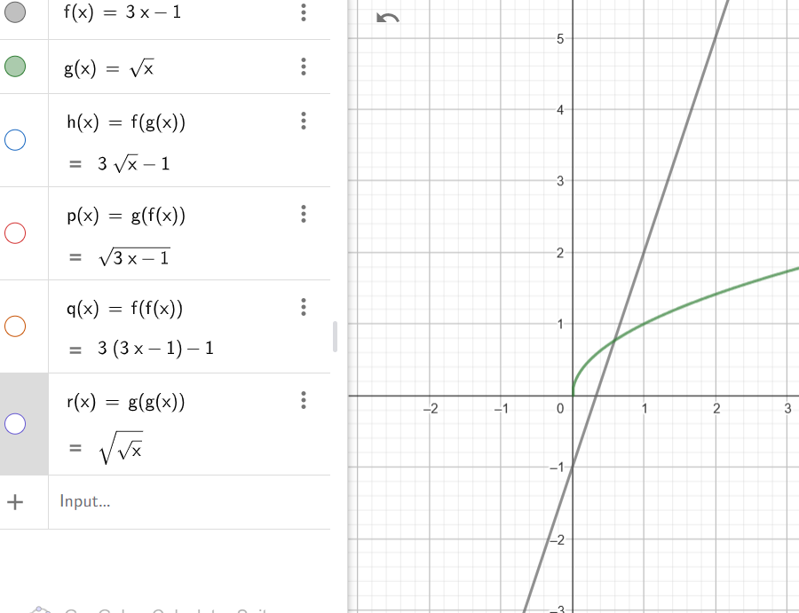

### Problem

Let $f(x) = 3x - 1$ and $g(x) = \sqrt{x}$. Find:
- $f(g(x))$
- $g(f(x))$
- $f(f(x))$
- $g(g(x))$

and visualize functions in a single GeoGebra notebook.

                                          TASK-1

### Solution

#### Given:
1. $f(x) = 3x - 1$
2. $g(x) = \sqrt{x}$

We need to compute $f(g(x))$, which means substituting $g(x)$ into $f(x)$.

---

#### Steps:
1. Substitute $g(x) = \sqrt{x}$ into $f(x) = 3x - 1$:

   $$f(g(x)) = f(\sqrt{x})$$

2. Apply the definition of $f(x) = 3x - 1$, replacing $x$ in $f(x)$ with $\sqrt{x}$:

   $$f(\sqrt{x}) = 3(\sqrt{x}) - 1$$

3. Simplify:

   $$f(g(x)) = 3\sqrt{x} - 1$$

---

### Final Answer:
$$ f(g(x)) = 3\sqrt{x} - 1 $$

                                                      TASK-2

### Solution

#### Given:
1. $f(x) = 3x - 1$
2. $g(x) = \sqrt{x}$

We need to compute $g(f(x))$, which means substituting $f(x)$ into $g(x)$.

---

#### Steps:
1. Substitute $f(x) = 3x - 1$ into $g(x) = \sqrt{x}$:
   $$ g(f(x)) = g(3x - 1) $$

2. Apply the definition of $g(x) = \sqrt{x}$, replacing $x$ in $g(x)$ with $3x - 1$:
   $$ g(3x - 1) = \sqrt{3x - 1} $$

3. Simplify:
   $$ g(f(x)) = \sqrt{3x - 1} $$

---

### Final Answer:
$$ g(f(x)) = \sqrt{3x - 1} $$

                                                    TASK-3
 ### Solution

#### Given:
1. $f(x) = 3x - 1$
2. $g(x) = \sqrt{x}$

We need to compute $f(f(x))$, which means applying $f(x)$ to the result of $f(x)$.

---

#### Steps:
1. Start with $f(x) = 3x - 1$. This is the first application of $f(x)$.

2. Apply $f$ again, replacing $x$ in $f(x)$ with $f(x)$:
   $$f(f(x)) = f(3x - 1)$$

3. Use the definition of $f(x) = 3x - 1$, replacing $x$ in $f(x)$ with $3x - 1$:
   $$f(3x - 1) = 3(3x - 1) - 1$$

4. Simplify:
 $$f(3x - 1) = 9x - 3 - 1$$
 $$f(3x - 1) = 9x - 4$$

---

### Final Answer:
$$f(f(x)) = 9x - 4$$
                                            
         

                                         TASK-4
### Solution

#### Given:
1. $f(x) = 3x - 1$
2. $g(x) = \sqrt{x}$

We need to compute $g(g(x))$, which means applying $g(x)$ to the result of $g(x)$.

---

#### Steps:
1. Start with $g(x) = \sqrt{x}$. This is the first application of $g(x)$.

2. Apply $g$ again, replacing $x$ in $g(x)$ with $g(x)$:
   $$g(g(x)) = g(\sqrt{x})$$

3. Use the definition of $g(x) = \sqrt{x}$, replacing $x$ in $g(x)$ with $\sqrt{x}$:
   $$g(\sqrt{x}) = \sqrt{\sqrt{x}}$$

4. Simplify:
   $$g(g(x)) = x^{1/4}$$

---

### Final Answer:
$$g(g(x)) = x^{1/4}$$

### Problem

Let $f(x) = e^x$ and $g(x) = \ln(x)$. Check:
- $f(g(x))$
- $g(f(x))$

---

### Solution

1. **Compute $f(g(x))$:**
   Substitute $g(x) = \ln(x)$ into $f(x) = e^x$:
   $$f(g(x)) = f(\ln(x)) = e^{\ln(x)}$$

   Using the property of logarithms and exponents ($e^{\ln(x)} = x$):
   $$f(g(x)) = x$$

2. **Compute $g(f(x))$:**
   Substitute $f(x) = e^x$ into $g(x) = \ln(x)$:
   $$g(f(x)) = g(e^x) = \ln(e^x)$$

   Using the property of logarithms ($\ln(e^x) = x$):
   $$g(f(x)) = x$$

---

### Observation
For both $f(g(x))$ and $g(f(x))$, the result is:
$$x$$

This shows that $f(x)$ and $g(x)$ are **inverse functions** of each other.
