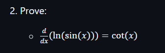
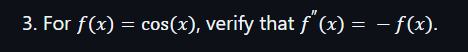
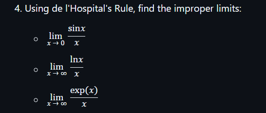

--------------
To prove that:

$$
\frac{d}{dx} \left( \ln(\sin(x)) \right) = \cot(x)
$$

### **Step-by-Step Proof**

1. **Apply the chain rule**:

The derivative of the natural logarithm, $\ln(u)$, is:

$$
\frac{d}{dx} \ln(u) = \frac{1}{u} \cdot \frac{du}{dx}
$$

Here, $u = \sin(x)$. So:

$$
\frac{d}{dx} \left( \ln(\sin(x)) \right) = \frac{1}{\sin(x)} \cdot \frac{d}{dx}(\sin(x))
$$

2. **Differentiate $\sin(x)$**:

The derivative of $\sin(x)$ with respect to $x$ is:

$$
\frac{d}{dx}(\sin(x)) = \cos(x)
$$

Substitute this result into the equation:

$$
\frac{d}{dx} \left( \ln(\sin(x)) \right) = \frac{1}{\sin(x)} \cdot \cos(x)
$$

3. **Simplify the expression**:

Simplify the fraction:

$$
\frac{\cos(x)}{\sin(x)} = \cot(x)
$$

4. **Final result**:

Thus, we have:

$$
\frac{d}{dx} \left( \ln(\sin(x)) \right) = \cot(x)
$$

### **Conclusion**:

The proof is complete!
----------------
To verify that for \( f(x) = \cos(x) \), the second derivative satisfies:

$$
f''(x) = -f(x)
$$

---

### **Step-by-Step Proof**

1. **Define the function**:

We are given:

$$
f(x) = \cos(x)
$$

2. **First derivative \( f'(x) \):**

The derivative of \( \cos(x) \) with respect to \( x \) is:

$$
f'(x) = -\sin(x)
$$

3. **Second derivative \( f''(x) \):**

Differentiate \( f'(x) = -\sin(x) \) again:

$$
f''(x) = -\frac{d}{dx}(\sin(x))
$$

The derivative of \( \sin(x) \) is \( \cos(x) \), so:

$$
f''(x) = -\cos(x)
$$

4. **Compare with \( -f(x) \):**

Recall that \( f(x) = \cos(x) \). Therefore:

$$
-f(x) = -\cos(x)
$$

Thus, we have:

$$
f''(x) = -f(x)
$$

---

### **Conclusion**:

We have verified that:

$$
f''(x) = -f(x)
$$
-------------------------------

### **Using de l'Hospital's Rule, find the improper limits**

---

#### **1. $\lim_{x\to0}\frac{\sin(x)}{x}$**

- **Step 1**: Identify the indeterminate form.  
As $x\to0$, $\sin(x)\to0$ and $x\to0$. The limit is of the form $\frac{0}{0}$.

- **Step 2**: Differentiate the numerator and denominator.  
Derivative of $\sin(x)$ is $\cos(x)$.  
Derivative of $x$ is $1$.

- **Step 3**: Apply L'Hospital's Rule:  
$$
\lim_{x\to0}\frac{\sin(x)}{x}=\lim_{x\to0}\frac{\cos(x)}{1}.
$$

- **Step 4**: Evaluate the limit.  
$$
\cos(0)=1.
$$

**Result**:  
$$
\lim_{x\to0}\frac{\sin(x)}{x}=1.
$$

---

#### **2. $\lim_{x\to\infty}\frac{\ln(x)}{x}$**

- **Step 1**: Identify the indeterminate form.  
As $x\to\infty$, $\ln(x)\to\infty$ and $x\to\infty$. The limit is of the form $\frac{\infty}{\infty}$.

- **Step 2**: Differentiate the numerator and denominator.  
Derivative of $\ln(x)$ is $\frac{1}{x}$.  
Derivative of $x$ is $1$.

- **Step 3**: Apply L'Hospital's Rule:  
$$
\lim_{x\to\infty}\frac{\ln(x)}{x}=\lim_{x\to\infty}\frac{\frac{1}{x}}{1}.
$$

- **Step 4**: Simplify and evaluate the limit.  
$$
\frac{\frac{1}{x}}{1}=\frac{1}{x}.
$$  
As $x\to\infty$, $\frac{1}{x}\to0$.

**Result**:  
$$
\lim_{x\to\infty}\frac{\ln(x)}{x}=0.
$$

---

#### **3. $\lim_{x\to\infty}\frac{\exp(x)}{x}$**

- **Step 1**: Identify the indeterminate form.  
As $x\to\infty$, $\exp(x)\to\infty$ and $x\to\infty$. The limit is of the form $\frac{\infty}{\infty}$.

- **Step 2**: Differentiate the numerator and denominator.  
Derivative of $\exp(x)$ is $\exp(x)$.  
Derivative of $x$ is $1$.

- **Step 3**: Apply L'Hospital's Rule:  
$$
\lim_{x\to\infty}\frac{\exp(x)}{x}=\lim_{x\to\infty}\frac{\exp(x)}{1}.
$$

- **Step 4**: Evaluate the limit.  
As $x\to\infty$, $\exp(x)\to\infty$.

**Result**:  
$$
\lim_{x\to\infty}\frac{\exp(x)}{x}=\infty.
$$

---

### **Final Answers**

1. $$\lim_{x\to0}\frac{\sin(x)}{x}=1$$  
2. $$\lim_{x\to\infty}\frac{\ln(x)}{x}=0$$  
3. $$\lim_{x\to\infty}\frac{\exp(x)}{x}=\infty$$

